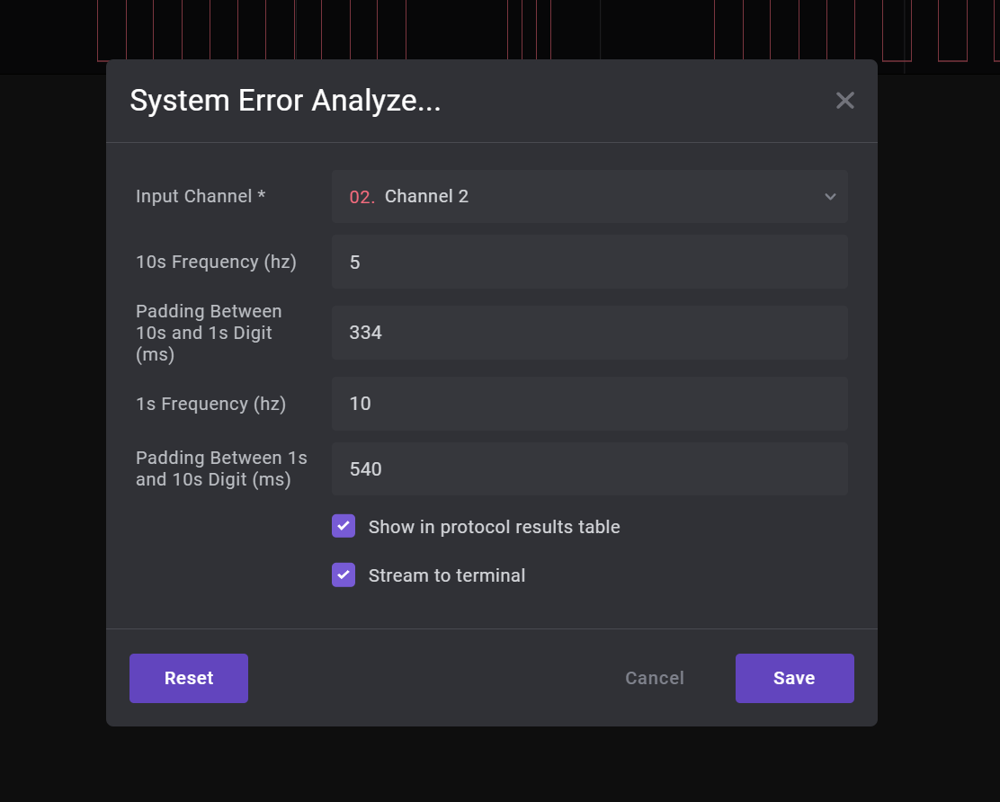
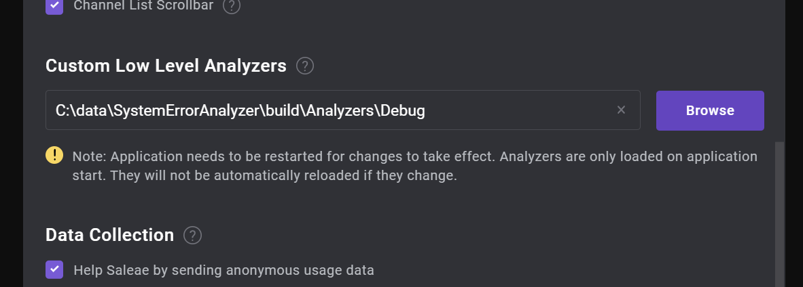

# System Error Analyzer 

- [](#)
    - [Downloading](#downloading)
    - [Using downloaded analyzer binaries on MacOS](#using-downloaded-analyzer-binaries-on-macos)
  - [Prerequisites](#prerequisites)
    - [Windows](#windows)
    - [MacOS](#macos)
    - [Linux](#linux)
  - [Building](#building)
    - [Windows](#windows-1)
    - [MacOS](#macos-1)
    - [Linux](#linux-1)
  - [Generating Analyzer Simulation Data](#generating-analyzer-simulation-data)
  - [Debugging](#debugging)
    - [Windows](#windows-2)
    - [MacOS](#macos-2)
    - [Linux](#linux-2)

This analyzer helps identify error codes on a low level heartbeat/error line. It's able to identify pulses that diviate significantly due to the inacuracy of pulsing low level error codes. Configure by taking a guess on your own timings and entering them into the settings page. 




### Downloading

Go to the github [releases](https://github.com/enzobarrett/SystemErrorAnalyzer/releases/) page and download the appropriate zip file for your platform. Install by selecting a low level analyzer directory in logic's prefrences, and copy the downloaded binary into the folder.




### Using downloaded analyzer binaries on MacOS

This section only applies to downloaded pre-built protocol analyzer binaries on MacOS. If you build the protocol analyzer locally, or acquire it in a different way, this section does not apply.

Any time you download a binary from the internet on a Mac, wether it be an application or a shared library, MacOS will flag that binary for "quarantine". MacOS then requires any quarantined binary to be signed and notarized through the MacOS developer program before it will allow that binary to be executed.

Because of this, when you download a pre-compiled protocol analyzer plugin from the internet and try to load it in the Saleae software, you will most likely see an error message like this:

> "libSimpleSerialAnalyzer.so" cannot be opened because th developer cannot be verified.

Signing and notarizing of open source software can be rare, because it requires an active paid subscription to the MacOS developer program, and the signing and notarization process frequently changes and becomes more restrictive, requiring frequent updates to the build process.

The quickest solution to this is to simply remove the quarantine flag added by MacOS using a simple command line tool.

Note - the purpose of code signing and notarization is to help end users be sure that the binary they downloaded did indeed come from the original publisher and hasn't been modified. Saleae does not create, control, or review 3rd party analyzer plugins available on the internet, and thus you must trust the original author and the website where you are downloading the plugin. (This applies to all software you've ever downloaded, essentially.)

To remove the quarantine flag on MacOS, you can simply open the terminal and navigate to the directory containing the downloaded shared library.

This will show what flags are present on the binary:

```sh
xattr libSimpleSerialAnalyzer.so
# example output:
# com.apple.macl
# com.apple.quarantine
```

This command will remove the quarantine flag:

```sh
xattr -r -d com.apple.quarantine libSimpleSerialAnalyzer.so
```

To verify the flag was removed, run the first command again and verify the quarantine flag is no longer present.

## Prerequisites

### Windows

Dependencies:

- Visual Studio 2017 (or newer) with C++
- CMake 3.13+

**Visual Studio 2017**

_Note - newer versions of Visual Studio should be fine._

Setup options:

- Programming Languages > Visual C++ > select all sub-components.

Note - if CMake has any problems with the MSVC compiler, it's likely a component is missing.

**CMake**

Download and install the latest CMake release here.
https://cmake.org/download/

### MacOS

Dependencies:

- XCode with command line tools
- CMake 3.13+

Installing command line tools after XCode is installed:

```
xcode-select --install
```

Then open XCode, open Preferences from the main menu, go to locations, and select the only option under 'Command line tools'.

Installing CMake on MacOS:

1. Download the binary distribution for MacOS, `cmake-*-Darwin-x86_64.dmg`
2. Install the usual way by dragging into applications.
3. Open a terminal and run the following:

```
/Applications/CMake.app/Contents/bin/cmake-gui --install
```

_Note: Errors may occur if older versions of CMake are installed._

### Linux

Dependencies:

- CMake 3.13+
- gcc 5+

Misc dependencies:

```
sudo apt-get install build-essential
```

## Building

### Windows

```bat
mkdir build
cd build
cmake .. -A x64
cmake --build .
:: built analyzer will be located at SampleAnalyzer\build\Analyzers\Debug\SimpleSerialAnalyzer.dll
```

### MacOS

```bash
mkdir build
cd build
cmake ..
cmake --build .
# built analyzer will be located at SampleAnalyzer/build/Analyzers/libSimpleSerialAnalyzer.so
```

### Linux

```bash
mkdir build
cd build
cmake ..
cmake --build .
# built analyzer will be located at SampleAnalyzer/build/Analyzers/libSimpleSerialAnalyzer.so
```

## Generating Analyzer Simulation Data

The Logic 2 software will need to be opened from the terminal using a specific command to enable simluation mode. Otherwise, by default, when an analyzer is added to digital channels while in Demo mode (i.e. no Logic is connected to the PC), the simulation data on those digital channels will contain seemingly random transitions and will not contain analyzer-specific data.

For instructions on enabling simulation mode on the Logic 2 software, please follow the instructions here:
https://support.saleae.com/user-guide/using-logic/demo-mode#generating-analyzer-simulation-data 

## Debugging

Although the exact debugging process varies slightly from platform to platform, part of the process is the same for all platforms.

First, build your analyzer. Then, in the Logic 2 software, load your custom analyzer, and then restart the software. Instructions can be found here: https://support.saleae.com/faq/technical-faq/setting-up-developer-directory

Once restarted, the software should show your custom analyzer in the list of available analyzers.

Next, in order to attach your debugger, you will need to find the process ID of the Logic 2 software. To make this easy, we display the process ID of the correct process in the About dialog in the software, which you can open from the main menu. It's the last item in the "Build Info" box, labeled "PID". Note that this is not the correct PID when using an ARM based M1 Mac. (Please contact support for details on debugging on M1 Macs.)

You will need that PID number for the platform specific steps below.

Note, we strongly recommend only debugging your analyzer on existing captures, and not while making new recordings. The act of pausing the application with the debugger while recording data will cause the recording to fail once the application is resumed. To make development smooth, we recommend saving the capture you wish to debug with before starting the debugging process, so you can easily re-load it later.

### Windows

when `cmake .. -A x64` was run, a Visual Studio solution file was created automatically in the build directory. To debug your analyzer, first open that solution in visual studio.

Then, open the Debug menu, and select "attach to process...".

Enter the PID number into the Filter box to find the correct instance of Logic.exe.

Click attach.

Next, place a breakpoint somewhere in your analyzer source code. For example, the start of the WorkerThread function.

Make sure you already have recorded data in the application, and then add an instance of your analyzer. The debugger should pause at the breakpoint.

### MacOS

We don't have a clear process for how to debug custom protocol analyzers on MacOS. If you attempt to attach a debugger to the Logic 2 software, you will likely see an error like this:

> error: attach failed: attach failed (Not allowed to attach to process. Look in the console messages (Console.app), near the debugserver entries, when the attach failed. The subsystem that denied the attach permission will likely have logged an informative message about why it was denied.)

Checking the output in Console.app, you will likely find logs like this:

> macOSTaskPolicy: (com.apple.debugserver) may not get the task control port of (Logic2 Helper (R) (pid: 95234): (Logic2 Helper (R) is hardened, (Logic2 Helper (R) doesn't have get-task-allow, (com.apple.debugserver) is a declared debugger(com.apple.debugserver) is not a declared read-only debugger

This is likely due to our signing and notarization process on MacOS not adding the `get-task-allow` entitlement. If you're in need of MacOS debugging, please contact Saleae support to request it.

### Linux

(Note, this section needs to be tested and updated if needed)

On Linux, you can debug your custom analyzer using GDB. This can be done from the console, however we recommend using a GUI tool like Visual Studio Code, with the C++ extension installed.

To debug from the command line, once you have loaded your analyzer into the logic software and have checked the process ID, you can attach gdb like so:

```bash
gdb
attach <pid>
```

If you see a permissions error like this, you will need to temporarily change the `ptrace_scope` setting on your system.

> Could not attach to process. [...] ptrace: Operation not permitted.

You can change the `ptrace_scope` like so, which will then allow you to attach to another process without sudo. (Be sure to `quit` gdb first)

```bash
sudo sysctl -w kernel.yama.ptrace_scope=0
```

You can learn more about `ptrace_scope` here: https://www.kernel.org/doc/Documentation/security/Yama.txt

Next, test setting a breakpoint like this. Be sure to use the correct class name.

```
break MyAnalyzer::WorkerThread
```

finally, attaching to the process will have paused the Logic application execution. Resume it with the continue command:

```bash
continue
```

If your analyzer hasn't been loaded yet, GDB will notify you that it can't find this function, and ask if you want to automatically set this breakpoint if a library with a matching function is loaded in the future. Type `y <enter>`

Then return to the application and add your analyzer. This should trigger the breakpoint.

To verify that symbols for your custom analyzer are loading, check the backtrace with the `bt` command. Example output:

```
#0  0x00007f2677dc42a8 in I4CAnalyzer::WorkerThread() ()
   from /home/build/Downloads/SampleAnalyzer-modernization-2022/build/Analyzers/libI4CAnalyzer.so
#1  0x00007f267046f24a in Analyzer::InitialWorkerThread() () from /tmp/.mount_Logic-0Fyxvr/resources/linux/libAnalyzer.so
#2  0x00007f267263bed9 in ?? () from /tmp/.mount_Logic-0Fyxvr/resources/linux/libgraph_server_shared.so
#3  0x00007f267264688e in ?? () from /tmp/.mount_Logic-0Fyxvr/resources/linux/libgraph_server_shared.so
#4  0x00007f26828e1609 in start_thread (arg=<optimized out>) at pthread_create.c:477
#5  0x00007f2681136293 in clone () at ../sysdeps/unix/sysv/linux/x86_64/clone.S:95
```
